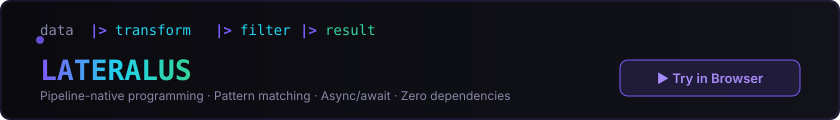

<div align="center">


<br><br>

[](https://bad-antics.github.io/)
[](https://bad-antics.github.io/lateralus/playground/)
[](https://marketplace.visualstudio.com/items?itemName=lateralus.lateralus-lang)
[](https://pypi.org/project/lateralus-lang/)

</div>


<div align="center">

**Security researcher** · **language designer** · **732 repos** · **140+ tools** · **1M+ reach**

*Merged PRs in* **h4cker** ⭐25.6k · **Awesome-Hacking** ⭐108.8k · **android-security-awesome** ⭐9.3k · **awesome-flipperzero** ⭐23k

</div>


## |> Lateralus Programming Language

<div align="center">

<a href="https://bad-antics.github.io/lateralus/playground/">

</a>

</div>

A compiled programming language where **data flows left-to-right** with the pipeline operator `|>`. Pattern matching, async/await, structs with impl blocks, `try/recover/ensure` error handling — and zero dependencies.

```
let report = transactions
    |> filter(|t| t.amount > 20.0)
    |> group_by(|t| t.category)
    |> sort_by(|e| e.total, descending)
```

| | |
|:---|:---|
| 🌐 **Website** | [bad-antics.github.io/lateralus](https://bad-antics.github.io/lateralus/) |
| ▶ **Playground** | [Try in browser — no install](https://bad-antics.github.io/lateralus/playground/) |
| 📦 **Install** | `pip install lateralus-lang` |
| 🧩 **VS Code** | [Marketplace](https://marketplace.visualstudio.com/items?itemName=lateralus.lateralus-lang) |
| 📚 **Tutorials** | [25 step-by-step lessons](https://github.com/bad-antics/lateralus-tutorials) |
| 🖥️ **LateralusOS** | [Full OS kernel written in .ltl](https://github.com/bad-antics/lateralus-os) |
| 📊 **Ecosystem** | 22 repos · 2,400+ .ltl files · compiler, VM, web framework, ML tools |


## 🐧 NullSec Linux v5.0

Security-focused Linux distribution with **140+ pre-installed tools**, AI-powered threat analysis, and 5 specialized editions spanning AMD64, ARM64, RISC-V, and Apple Silicon.

<table>
<tr>
<td width="50%">

**Editions:**
- 🔒 **Professional** — Full pentest suite
- 🏭 **Industrial** — ICS/SCADA security
- 📱 **Mobile** — Android/iOS testing
- ☁️ **Cloud** — AWS/GCP/Azure audit
- 🤖 **AI** — ML security research

</td>
<td width="50%">

**Highlights:**
- 🪓 **LogReaper** ⭐72 — High-speed log forensics
- 🔍 **RKHunt** v2.5 — 250+ rootkit signatures
- ☁️ **CloudAudit** — 500+ compliance checks
- 🤖 **LLMRed** — AI/ML red teaming
- 🛡️ **RCE Shield** — PC gamer hardening

</td>
</tr>
</table>

[](https://github.com/bad-antics/nullsec-linux)


## 💻 Tech Stack

<table>
<tr>
<td valign="top" width="33%">

**⚡ Systems & Low-Level**


</td>
<td valign="top" width="33%">

**🔬 Scientific & HPC**


</td>
<td valign="top" width="33%">

**☁️ Cloud & DevOps**


</td>
</tr>
<tr>
<td valign="top" width="33%">

**📜 Scripting & Automation**


</td>
<td valign="top" width="33%">

**🐧 Linux & Embedded**


</td>
<td valign="top" width="33%">

**🔒 Security Tools**


</td>
</tr>
</table>


## 🚀 Featured Projects

<table>
<tr>
<td width="50%" valign="top">

### 🌐 Marshall Browser v3.0
Privacy-focused security browser with **Dr. Marshall AI assistant** and built-in exploit tools.

[](https://github.com/bad-antics/marshall)

</td>
<td width="50%" valign="top">

### 📱 NullKia v3.0
Mobile security framework — **18 manufacturers**, baseband exploitation, 5G/LTE testing, TEE/TrustZone research.

[](https://github.com/bad-antics/nullkia)

</td>
</tr>
<tr>
<td width="50%" valign="top">

### 🚗 BlackFlag
Automotive & ECU security — CAN bus, OBD-II, UDS protocols, key fob analysis, ECU fuzzing.

[](https://github.com/bad-antics/blackflag)

</td>
<td width="50%" valign="top">

### 🛡️ RCE Shield
RCE hardening for PC gamers — game launcher scanning, anti-cheat auditing, mod & overlay vulnerability checks.

[](https://github.com/bad-antics/rce-shield)

</td>
</tr>
</table>


## 🔮 Julia Security Suite

*High-performance security research in Julia · 40,000+ lines*

| Tool | Description | Lines |
|:-----|:------------|------:|
| [**🔬 Spectra**](https://github.com/bad-antics/spectra) | Cryptography, network analysis, forensics toolkit | 8,000+ |
| [**🔮 Oracle**](https://github.com/bad-antics/oracle) | AI vulnerability discovery — 87% prediction accuracy | 11,389 |
| [**👻 Phantom**](https://github.com/bad-antics/phantom) | Zero-knowledge proofs for anonymous disclosure | 6,302 |
| [**🌀 Vortex**](https://github.com/bad-antics/vortex) | Threat intelligence fusion — 50+ feeds, ML correlation | 8,406 |
| [**🪞 Mirage**](https://github.com/bad-antics/mirage) | Adversarial ML — attacks, defenses, robustness | 7,000+ |


## 🖥️ N01D Desktop Suite

| App | Description |
|:----|:------------|
| [**n01d-forge**](https://github.com/bad-antics/n01d-forge) ⭐9 | Secure image burner — LUKS, VeraCrypt, secure erase |
| [**n01d-machine**](https://github.com/bad-antics/n01d-machine) ⭐8 | VM manager — sandboxing, Tor, VPN isolation |
| [**n01d-media**](https://github.com/bad-antics/n01d-media) | Unified media player, editor & encoder |
| [**n01d-overwatch**](https://github.com/bad-antics/n01d-overwatch) | Real-time global conflict OSINT dashboard |
| [**n01d-docker**](https://github.com/bad-antics/n01d-docker) | Custom security & dev containers |
| [**n01d-timemachine**](https://github.com/bad-antics/n01d-timemachine) | Classic computing emulator — C64, Amiga, ZX, DOS |


## 🍍🐬 Device Suites

<table>
<tr>
<td width="50%" valign="top">

### 🍍 Pineapple Suite ⭐31
**96+ WiFi Pineapple Pager payloads** across 13 categories.

[](https://github.com/bad-antics/nullsec-pineapple-suite)

</td>
<td width="50%" valign="top">

### 🐬 Flipper Suite ⭐24
**430+ Flipper Zero files** — BadUSB, SubGHz, NFC, RFID, IR, animations.

[](https://github.com/bad-antics/nullsec-flipper-suite)

</td>
</tr>
<tr>
<td colspan="2">

### 🔥 Unleash Hell Collection
Hellfire-themed packs — 10 animations (88 frames) for Flipper Zero, 113 themed UI components for WiFi Pineapple Pager.

[](https://github.com/bad-antics/nullsec-unleash-hell)
[](https://github.com/bad-antics/nullsec-unleash-hell-pager)

</td>
</tr>
</table>


## ✅ Community Contributions

<div align="center">

**60 merged PRs** · **195 total submitted** · **1M+ combined stars**

*Accepted contributions across 17 major open-source security projects*

</div>

<table>
<tr>
<td valign="top" width="50%">

| Repository | ⭐ | Status |
|:-----------|---:|:------:|
| [**Awesome-Hacking**](https://github.com/Hack-with-Github/Awesome-Hacking) | 108.8k | ✅ |
| [**h4cker**](https://github.com/The-Art-of-Hacking/h4cker) | 25.6k | ×5 ✅ |
| [**awesome-pentest**](https://github.com/enaqx/awesome-pentest) | 25.6k | ✅ |
| [**awesome-osint**](https://github.com/jivoi/awesome-osint) | 25.4k | ✅ |
| [**awesome-flipperzero**](https://github.com/djsime1/awesome-flipperzero) | 23k | ✅ |
| [**awesome-privacy**](https://github.com/pluja/awesome-privacy) | 18.3k | ✅ |

</td>
<td valign="top" width="50%">

| Repository | ⭐ | Status |
|:-----------|---:|:------:|
| [**awesome-security**](https://github.com/sbilly/awesome-security) | 14.1k | ✅ |
| [**android-security-awesome**](https://github.com/ashishb/android-security-awesome) | 9.3k | ✅ |
| [**awesome-web-hacking**](https://github.com/infoslack/awesome-web-hacking) | 6.8k | ✅ |
| [**awesome-iot**](https://github.com/HQarroum/awesome-iot) | 3.9k | ✅ |
| [**bashbunny-payloads**](https://github.com/hak5/bashbunny-payloads) | 2.9k | ✅ |
| [**awesome-linux-rootkits**](https://github.com/milabs/awesome-linux-rootkits) | 2k | ✅ |

</td>
</tr>
</table>


## 📊 GitHub Stats

<div align="center">

<a href="https://github.com/bad-antics">

</a>
<a href="https://github.com/bad-antics">

</a>

</div>


<div align="center">

[](https://bad-antics.github.io/)
&nbsp;
[](https://bad-antics.github.io/lateralus/playground/)

*For authorized security testing and educational purposes only.*

**© 2024-2026 bad-antics · Security Engineering · Systems Research · Language Design**

</div>
