  

 

<h2>|> Lateralus Programming Language</h2>

  

A compiled language where **data flows left-to-right** through the pipeline operator `|>`
 
Pattern matching · async/await · structs with impl blocks · zero dependencies

  

**What's new (Apr 2026):** Wave 11 stdlib expansion adds a `ranking` module
(BM25 · TF-IDF · cosine), an `lt-trace` profiler, and a 30-minute "first hour"
tutorial. Plus 5 new Advent-of-Code 2023 solutions and 5 fresh Rosetta classics
joining the 10-pillar `@law` verification pipeline.
**138 stdlib modules · 2055 tests green · 0 regressions** · [read the CHANGELOG →](https://github.com/bad-antics/lateralus-lang/blob/main/CHANGELOG.md)

  

 

 

## 🔥 Featured Projects

<table>
<tr>
<td width="50%" valign="top">

### 🐧 NullSec Linux v5.0
Security-focused distro · **140+ tools** · 5 editions
 AMD64 · ARM64 · RISC-V · Apple Silicon

</td>
<td width="50%" valign="top">

### 🌐 Marshall Browser v3.0
Privacy browser · **Dr. Marshall AI** · built-in exploit tools

</td>
</tr>
<tr>
<td width="50%" valign="top">

### 📱 NullKia v3.0
Mobile security · **18 manufacturers** · 5G/LTE · TEE/TrustZone

</td>
<td width="50%" valign="top">

### 🚗 BlackFlag
Automotive security · CAN bus · OBD-II · ECU fuzzing

</td>
</tr>
</table>

 

## 🔮 Research & Tool Suites

<table>
<tr>
<td valign="top" width="33%">

**Julia Security Suite**
 *40,000+ lines · HPC security research*

🔬 [Spectra](https://github.com/bad-antics/spectra) — Crypto & forensics
 🔮 [Oracle](https://github.com/bad-antics/oracle) — AI vuln discovery
 👻 [Phantom](https://github.com/bad-antics/phantom) — Zero-knowledge proofs
 🌀 [Vortex](https://github.com/bad-antics/vortex) — Threat intel fusion
 🪞 [Mirage](https://github.com/bad-antics/mirage) — Adversarial ML

</td>
<td valign="top" width="33%">

**N01D Desktop Suite**
 *Security-focused desktop apps*

🔥 [n01d-forge](https://github.com/bad-antics/n01d-forge) ⭐9 — Secure burner
 🖥️ [n01d-machine](https://github.com/bad-antics/n01d-machine) ⭐8 — VM manager
 🎬 [n01d-media](https://github.com/bad-antics/n01d-media) — Media suite
 🌍 [n01d-overwatch](https://github.com/bad-antics/n01d-overwatch) — OSINT dashboard
 🐳 [n01d-docker](https://github.com/bad-antics/n01d-docker) — Security containers
 ⏰ [n01d-timemachine](https://github.com/bad-antics/n01d-timemachine) — Retro emulator

</td>
<td valign="top" width="33%">

**Device Suites**
 *Hardware hacking payloads*

�� [Pineapple Suite](https://github.com/bad-antics/nullsec-pineapple-suite) ⭐31
 &nbsp;&nbsp;&nbsp;&nbsp;96+ WiFi Pineapple payloads
 🐬 [Flipper Suite](https://github.com/bad-antics/nullsec-flipper-suite) ⭐24
 &nbsp;&nbsp;&nbsp;&nbsp;430+ Flipper Zero files
 🔥 [Unleash Hell](https://github.com/bad-antics/nullsec-unleash-hell)
 &nbsp;&nbsp;&nbsp;&nbsp;Themed packs for both devices
 🛡️ [RCE Shield](https://github.com/bad-antics/rce-shield)
 &nbsp;&nbsp;&nbsp;&nbsp;PC gamer hardening

</td>
</tr>
</table>

 

## ✅ Community Impact

**81 merged PRs** across **51 repos** · combined **1M+ ⭐**

| | | | |
|:--|:--|:--|:--|
| [**Awesome-Hacking**](https://github.com/Hack-with-Github/Awesome-Hacking) ⭐108.8k | [**h4cker**](https://github.com/The-Art-of-Hacking/h4cker) ⭐25.6k ×5 | [**awesome-pentest**](https://github.com/enaqx/awesome-pentest) ⭐25.6k | [**awesome-osint**](https://github.com/jivoi/awesome-osint) ⭐25.4k |
| [**awesome-flipperzero**](https://github.com/djsime1/awesome-flipperzero) ⭐23k | [**awesome-privacy**](https://github.com/pluja/awesome-privacy) ⭐18.3k | [**awesome-security**](https://github.com/sbilly/awesome-security) ⭐14.1k | [**android-security**](https://github.com/ashishb/android-security-awesome) ⭐9.3k |
| [**awesome-web-hacking**](https://github.com/infoslack/awesome-web-hacking) ⭐6.8k | [**awesome-iot**](https://github.com/HQarroum/awesome-iot) ⭐3.9k | [**bashbunny-payloads**](https://github.com/hak5/bashbunny-payloads) ⭐2.9k | [**awesome-rootkits**](https://github.com/milabs/awesome-linux-rootkits) ⭐2k |

 

<b>💻 Tech Stack</b>

 

<table>
<tr>
<td valign="top" width="33%">

**⚡ Systems & Low-Level**

</td>
<td valign="top" width="33%">

**🔬 Scientific & HPC**

</td>
<td valign="top" width="33%">

**☁️ Cloud & DevOps**

</td>
</tr>
<tr>
<td valign="top" width="33%">

**📜 Scripting**

</td>
<td valign="top" width="33%">

**🐧 Linux & Embedded**

</td>
<td valign="top" width="33%">

**🔒 Security**

</td>
</tr>
</table>

 

 

&nbsp;&nbsp;

  

&nbsp;

 

*For authorized security testing and educational purposes only.*

**© 2023-2026 bad-antics**

